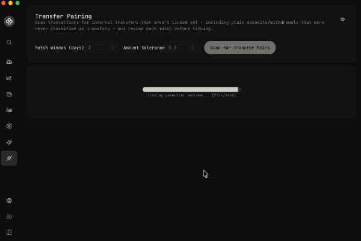

# transfer finder wealthfolio addon

Finds likely transfer pairs in activity history and lets you link them.

It scans cash-movement activities, proposes matches, and supports linking pairs that are already transfer-typed or need reclassification first.

## Requirement

Requires Wealthfolio 3.9.0 or later, the first release that includes the addon transfer-linking API ([PR #1307](https://github.com/wealthfolio/wealthfolio/pull/1307)).

## Installation

1. Download `wealthfolio-transfer-finder-addon-<version>.zip` from the [latest release](https://github.com/markrickert/wealthfolio-transfer-finder/releases/latest).
2. In Wealthfolio, open **Settings → Addons** and choose **Install from File**.
3. Select the zip and approve the requested `activities` permissions.

To update, install the newer zip the same way.

## Preview

